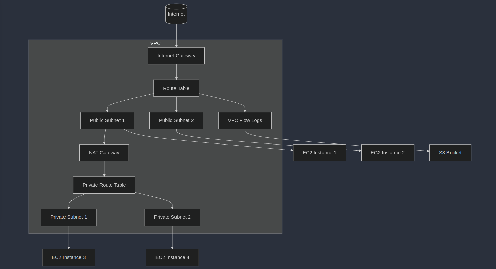

## VPC Basics
- vpc is a private network in the cloud. 
- It acts same as a gateway for local networks.
- Aws architecture -> Region -> Availability zones -> VPC(regional, spans AZs) -> Public subnets(tied to AZ, accessible from internet), private subnets(not accessible by the internet: within we have ec2 nstances) 

### Classless Inter-Domain Routing(CIDR)
- Notation for describing blocks of IP addresses

### VPC Architecture

**Diagram Explanation:**
- Internet Gateway (IGW) connects the VPC to the Internet.
- Public Subnets can communicate with the Internet directly via the IGW.
- Private Subnets communicate with the Internet through a `NAT Gateway`.
- Route Tables control the traffic flow between the subnets and the Internet.
- VPC Flow Logs monitor and log the traffic in the VPC, and logs are stored in S3.

## Virtual Private Cloud (VPC) - Brief Notes:
- A Virtual Private Cloud (VPC) is a logically isolated section of a cloud provider's infrastructure, allowing users to define a virtual network within the cloud. It provides full control over networking settings like `IP address ranges, subnets, route tables, and gateways`.

**Key Concepts:**

Subnets: Divide the VPC into smaller networks (public and private).

`Internet Gateway (IGW):` Enables Internet access for resources in public subnets.

`NAT Gateway:` Allows resources in private subnets to access the Internet securely.

`Route Tables:` Control traffic flow between subnets and the Internet.

`Security Groups & Network ACLs:` Define inbound and outbound rules for network security.

**Use Cases:**
- Hosting scalable web applications.
- Isolating and securing sensitive workloads.
- Customizable IP ranges and subnets for multi-tier architectures.

A VPC is fundamental for secure, scalable, and flexible cloud infrastructure.

### Understanding Routing in cloud
- `Regions` --> in regions we have `VPCs` --> in vpcs we have `subnets(private(10.0.48.0/20) & public(10.0.0.0/20))`
- We've also got `AZs` in VPCs
- I`nternet Gateway` is found at the VPC level for inbound and outbound traffic
- A VPC has a default reoute table, Main route table is implicitly associated with subnets that have been explicitly associated with a route table
- Main route table
-----------------------------------
Destination        | Target       |
-----------------------------------
10.0.0.0/16        | Local        |
-----------------------------------
0.0.0.0/0          |igw-id        |
-----------------------------------

- **Private route table**
-----------------------------------
Destination        | Target       |
-----------------------------------
10.0.0.0/16        | Local        |
-----------------------------------

- Each subnet can only be associated with one route table at a time
- A NAT(Network Address Translation) gateway is always in the public subnet
- In the context of AWS VPC (Virtual Private Cloud), NAT gateways are used to enable outbound internet access for instances in private subnets. Here's how NAT works in this context:
1. Instances in the private subnet send outbound traffic to the internet through the NAT gateway.
2. The NAT gateway translates the source IP address of the outbound traffic to the public IP address of the NAT gateway.
3. The NAT gateway forwards the traffic to the internet, and the response traffic is sent back to the NAT gateway
4. The NAT gateway translates the destination IP address of the response traffic back to the private IP address of the instance.
5. The instance receives the response traffic as if it were coming from the internet.

### CIDR(Classless inter-Domain Routing)
- CIDR (Classless Inter-Domain Routing) is a method used to define and allocate IP address ranges in a more flexible and scalable manner than traditional classful network addressing. It is widely used in networking and cloud computing to simplify IP address management and enable the creation of larger, more efficient networks.

- CIDR notation represents an IP address range using a combination of the network address and the network prefix length. The network prefix length specifies the number of leading bits in the IP address that are used to identify the network, while the remaining bits are used for host addresses.

- Examples
- 192.168.0.0/24: This represents a network with a network address of 192.168.0.0 and a network prefix length of 24. This means that the network consists of 256 possible host addresses (2^8), ranging from 192.168.0.1 to 192.168.0.254. The last address, 192.168.0.255, is typically reserved for the network broadcast address.

- In cloud computing, CIDR notation is used to define the IP address range for virtual networks, subnets, and other resources. By using CIDR notation, cloud providers can easily allocate and manage IP addresses across multiple regions and availability zones, ensuring scalability and fault tolerance.

- `Longest prefix` always wins, so all 172.16.0.0 traffic goes via peer 1 except traffic to 172.16.0.15 which goes viat peer 2
