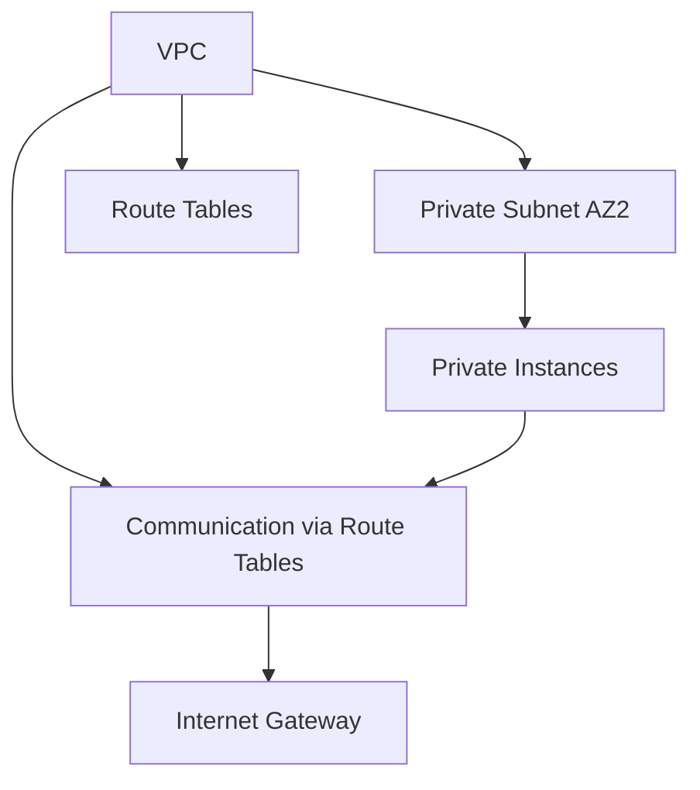

# Understanding CIDR and Route Tables:

- CIDR notation is used to define IP address ranges. It combines an IP address and a subnet mask into a compact form. 
- The subnet mask tells you which portion of the IP address is the network part and which portion is for hosts.

### Example of CIDR calculation:

 **1. Network: 10.0.0.0/24**
   - Network address: 10.0.0.0
   - Subnet mask: 255.255.255.0
   - Usable IPs: 10.0.0.1 to 10.0.0.254
   - Broadcast: 10.0.0.255

 **2. Network: 10.0.1.0/24**
   - Network address: 10.0.1.0
   - Subnet mask: 255.255.255.0
  - Usable IPs: 10.0.1.1 to 10.0.1.254
   - Broadcast: 10.0.1.255

### Example of Route Table with CIDR:

### Route table for public subnet to route traffic to the Internet Gateway
```bash
resource "aws_route_table" "public_route" {
  vpc_id = aws_vpc.main_vpc.id

  route {
    cidr_block = "0.0.0.0/0"       # Route all outbound traffic to the IGW
    gateway_id = aws_internet_gateway.igw.id
  }

  tags = {
    Name = "public_route"
  }
}
```
### Networking and Communication Between Two Availability Zones (AZs):

- When you have two AZs, you can design your networking architecture to ensure high availability.
- Subnets in different AZs allow resources to communicate across AZs for fault tolerance.

### Example of Two AZ Setup:

 - AZ1 (Public Subnet): 10.0.0.0/24 - Instances here can communicate with the Internet via the Internet Gateway.
 - AZ2 (Private Subnet): 10.0.1.0/24 - Instances here can communicate with AZ1 via VPC routing.

### Communication Example:

- AZ1 (Public Subnet) and AZ2 (Private Subnet) can communicate through VPC routing, with public-facing instances in AZ1 and private instances in AZ2.

### Mermaid Diagram illustrating the VPC architecture:



Key Notes:
- VPC Peering: Use VPC peering to allow cross-VPC traffic if needed.
- Security Groups: Configure these for controlling inbound and outbound traffic across AZs.
- NAT Gateways: Private subnets need NAT Gateway for internet access.
Example Scenario: High Availability
Deploy EC2 instances in AZ1 and AZ2, with an internal load balancer distributing traffic across them.
The load balancer helps route traffic to instances in both AZs, with route tables ensuring proper communication.
Best Practices for Two AZ Setup:
- Subnets in Each AZ: Deploy EC2, RDS, and other resources in each AZ for fault tolerance.
- Internal Load Balancer: Use an internal load balancer to distribute traffic between AZs.
- NAT Gateway: Place a NAT Gateway in a public subnet to allow private instances to access the internet.

**Conclusion:*

With multiple AZs, ensure proper CIDR subnetting, VPC route tables, and load balancing for high availability and fault tolerance.
